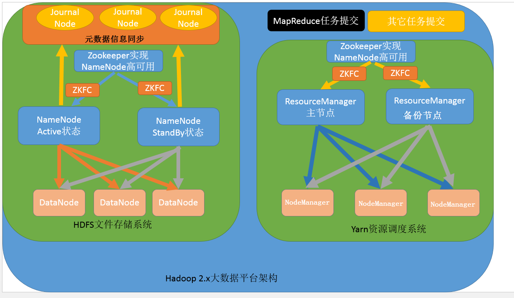

## 一 大数据发展简史

Hadoop最早起源于Nutch，一个基于Lucene的大型全网搜索引擎，包括网页抓取、索引、查询等功能，但随着抓取网页数量的增加，遇到了严重的可扩展性问题——如何解决数十亿网页的存储和索引问题。2003年、2004年谷歌发表的论文为该问题提供了可行的解决方案：
- 分布式文件系统 GFS ：用于处理海量网页的存储
- 分布式计算框架 MAPREDUCE ：用于处理海量网页的索引计算问题
- 非关系型数据库 BitTable： k、v对的非关系型数据库

Nutch的开发人员完成了 HDFS 和 MAPREDUCE 相应的开源实现，并从Nutch中了一个独立项目 Hadoop ，现在hadoop已经发展为大数据的一个生态，包括很多其他的软件，如图所示：  

  

大数据的核心技术体系：
- 大数据离线数据处理
  - Hadoop大数据平台：HDFS分布式文件系统，MapReduce分布式计算框架，Yarn资源管理平台
  - Hive数据仓库（底层是MR）
  - Sqoop关系行数据库和非关系型数据的导入导出（底层是MR）
  - Flume数据采集
- 大数据实时数据处理
  - Storm：如实时统计天猫双11销售额
  - Spark：一站式数据分析平台，基于Spark-Core，包含：SparkSql(类似Hive)，SparkStreaming（类似Storm），SparkMllib（机器学习），SparkGraphX（图计算）
  - 消息队列： Kafka
- 大数据新兴技术
  - Flink：一站式数据分析
  - Keylin数据分析：数据立方体

Hadoop 由Apache维护，地址：http://hadoop.apache.org。Hadoop的主要版本有2.x和3.x，其中2.x是在1.x的基础上更新了全新的架构，是当前 Hadoop 架构的基石。但由于apache hadoop更新过快不稳定，出现了许多第三方发行版本：
- hortonWorks：https://hortonworks.com/ 雅虎主导的免费开源版本，提供了完整的web管理界面。
- ClouderaManager：国内使用较多。分为收费和商业版，解决apache hadoop稳定性不足、兼容性不足、升级困难等问题。

## 二 认识Hadoop基础原理与分布式计算思想

Hadoop是一个分布式基础架构系统，其核心设计是 HDFS 和 MapReduce ，该系统类似于集群操作系统，可以用廉价的通用硬件形成资源池从而组成为强大的分布式集群系统，用户可以在不了解分布式底层细节的情况下开发分布式程序。其开发思想来自于谷歌的采集系统：
- GFS：Goole FileSystem，分布式文件系统，隐藏了下层的负载均衡，冗余赋值细节，为应用程序提供统一API接口
- Google MapReduce计算模型：大多数分布式运算都被抽象为了MapReduce操作。Map是把输入分解成KV键值对，Reduce是把KV合成最终输出。

Hadoop是谷歌采集系统的Java实现，包括：
- HDFS：GFS的开源实现
- MapReduce：GMR的开源实现

分布式计算，即将大量的运算切割为多个子运算任务，交给多台机器，每台机器运行一个子任务，最后将每台机器的运算结果进行整合形成要求的运算结果。  

计算1+2+3+...+1000的任务，切分为三个子任务：1+..+300，301+...+600，601+...+1000，然后由三台机器去运算这三个子任务，如图所示：  
 

## 三 认识Hadoop2.x架构

### 3.1 Hadoop2.x架构基础模型

2.x架构中，不再使用 的概念，而是引入了Yarn资源调度平台。  

  

- 分布式文件存储系统 HDFS ：
  - NameNode：集群的主节点，负责管理集群的元数据信息：文件名称、路径、大小、权限等描述信息
  - DataNode：集群的从节点，负责存储集群当中的各种数据
  - SecondaryNameNode：负责合并元数据信息，辅助namenode管理元数据信息
- 资源调度平台Yarn：
  - ResourceManager：接收用户的计算请求任务，但不负责任务的分配，只分配资源
  - NodeManager：负责执行任务

任务是如何分配的：ResourceManager接收到任务请求后，会在某个NodeManager上启动一个ApplicationMaster进程，该进程用于分配任务、资源申请。  

2.x与1.x区别：2.x全新引入了yarn计算平台，而在1.x中使用的是 JobTracker 和 TaskTracker。 JobTracker是主节点，负责接收用户提交的计算任务，分配任务给从节点执行。TaskTracker是从节点，负责接收主节点分配的任务，并执行任务。1.x模型主节点 NameNode 和 JobTracker 都存在单节点故障问题！只是一个主从关系，没有主备概念！ 

1.x叫架构如图：  
  

### 3.2 Hadoop2.x架构的高可用模型

在2.x架构的部署时，我们可以为NameNode、ResourceManager都进行多节点高可用部署。    

   

高可用架构：
- 文件系统核心模块：
  - NameNode：集群当中的主节点，主要用于管理集群当中的各种数据，其中 NameNode可以有两个，形成主备的高可用架构。 
    - active状态：负责用户的写请求
    - standBy状态：负责监听active什么时候宕机，宕机后称为主节点 
  - DataNode：集群当中的从节点，主要用于存储集群当中的各种数据
  - JournalNode：文件系统元数据信息管理
- 数据计算核心模块：
  - ResourceManager：Yarn平台的主节点，主要用于接收各种任务，通过两个，构建成高可用
  - NodeManager：Yarn平台的从节点，主要用于处理ResourceManager分配的任务

**NameNode高可用**：此时没有SecondaryNamenode，引入了JournalNode，用于同步元数据信息，保证两个NameNode的元数据信息是一致的。JournalNode需要奇数个，半数及以上的JournalNode写入元数据成功，就代表写入成功。  

为了避免集群的脑裂，造成看到的数据不一致，一定要保证两个NameNode当中的元数据信息一模一样，JournalNode就是同步两个NameNode当中的元数据信息，保证两个NameNode当中的元数据信息一模一样。    

NameNode高可用的自动切换，主要是通过ZKFC来实现的，即利用zookeeper的watch机制监控。  

**ResourceManager高可用**：集群节点中的一个节点会成为主节点，其他节点称为备份节点，当主节点宕机后，备份节点通过zookeeper选举一个成为新的ResourceManager主节点。
