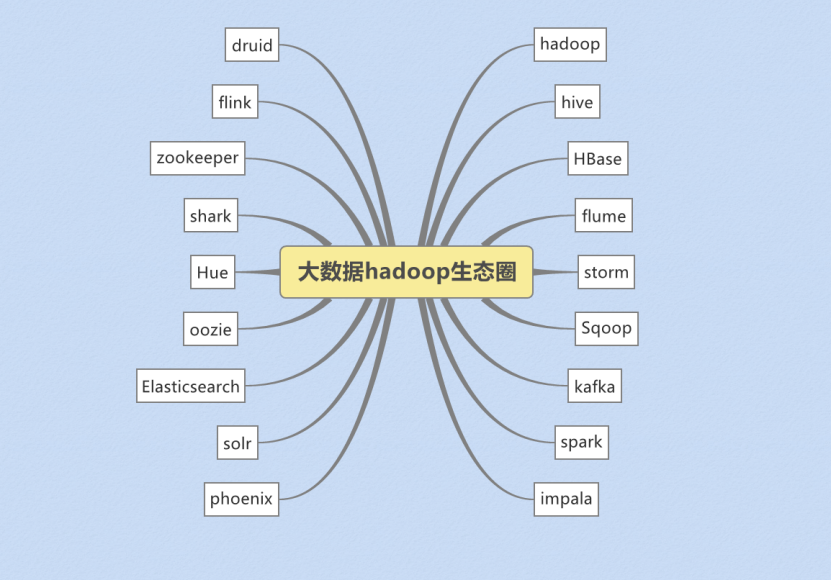

## 一 大数据发展简史

Hadoop最早起源于Nutch。Nutch（基于Lucene）的设计目标是构建一个大型的全网搜索引擎，包括网页抓取、索引、查询等功能，但随着抓取网页数量的增加，遇到了严重的可扩展性问题——如何解决数十亿网页的存储和索引问题。  

2003年、2004年谷歌发表的两篇论文为该问题提供了可行的解决方案：
- 分布式文件系统（GFS），可用于处理海量网页的存储
- 分布式计算框架MAPREDUCE，可用于处理海量网页的索引计算问题。

Nutch的开发人员完成了相应的开源实现HDFS和MAPREDUCE，并从Nutch中剥离成为独立项目HADOOP，到2008年1月，HADOOP成为Apache顶级项目(同年，cloudera公司成立)，迎来了它的快速发展期。  

狭义上来说，hadoop就是单独指代hadoop这个软件，广义上来说，hadoop指代大数据的一个生态圈，包括很多其他的软件，如图所示：  

  

大数据的核心技术体系：
- 大数据离线数据处理
  - Hadoop大数据平台：HDFS分布式文件系统，MapReduce分布式计算框架，Yarn资源管理平台
  - Hive数据仓库（底层是MR）
  - Sqoop关系行数据库和非关系型数据的导入导出（底层是MR）
  - Flume数据采集
- 大数据实时数据处理
  - Storm：如实时统计天猫双11销售额
  - Spark：一站式数据分析平台，基于Spark-Core，包含：SparkSql(类似Hive)，SparkStreaming（类似Storm），SparkMllib（机器学习），SparkGraphX（图计算）
  - 消息队列： Kafka
- 大数据新兴技术
  - Flink：一站式数据分析
  - Keylin数据分析：数据立方体

## 二 认识Hadoop原理

Hadoop是一个分布式基础架构系统，其核心设计师HDFS和MapReduce，该系统类似于集群操作系统，可以用廉价的通用硬件形成资源池从而组成为例强大的分布式集群系统，用户可以在不了解分布式底层细节的情况下开发分布式程序。其开发思想来自于谷歌的采集系统。  

谷歌的采集系统技术包括：
- GFS：Goole FileSystem，分布式文件系统，隐藏了下层的负载均衡，冗余赋值细节，为应用程序提供统一API接口
- Google MapReduce计算模型：大多数分布式运算都被抽象为了MapReduce操作。Map是把输入分解成KV键值对，Reduce是把KV合成最终输出。

Hadoop是谷歌采集系统的Java实现，包括：
- HDFS：GFS的开源实现
- MapReduce：GMR的开源实现

## 二 Hadoop版本

Hadoop的办法历史：
- 0.x系列版本：hadoop当中最早的一个开源版本，在此基础上演变而来的1.x以及2.x的版本
- 1.x版本系列：hadoop版本当中的第二代开源版本，主要修复0.x版本的一些bug等
- 2.x版本系列：架构产生重大变化，引入了yarn平台等许多新特性
- 3.x版本系列：

Hadoop的发型版本：
- apache hadoop：http://hadoop.apache.org/，更新快速，但是版本的维护、兼容、补丁都不稳定
- hortonWorks：https://hortonworks.com/ 雅虎主导的免费开源版本，提供了完整的web管理界面
- ClouderaManager：分为收费和商业版，解决apache hadoop稳定性不足、兼容性不足、升级困难等问题，国内使用较多

## 三 认识Hadoop1.x架构  

  

1.x架构分为两大模块：
- 分布式文件存储系统HDFS：
  - NameNode：集群当中的主节点，主要用于管理集群当中的各种数据(元数据信息)
  - secondaryNameNode：作用就是用于合并元数据信息，辅助namenode管理元数据信息
  - DataNode：集群当中的从节点，主要用于存储集群当中的各种数据
- 分布式文件计算系统MapReduce：
  - JobTracker：主节点，主要功能有接收用户提交的计算任务，分配任务给从节点执行
  - TaskTracker：从节点，主要用于接收主节点分配的任务，并执行任务

元数据信息：文件名称，文件路径，文件的大小，文件的权限等文件的描述数据

## 四 认识hadoop2.x架构 

1.x当中，主节点  namenode  jobtracker都存在单节点故障问题，2.x解决了该问题。  

#### 2.1 NameNode与ResourceManager单节点架构模型

  

- 分布式文件存储系统HDFS：
  - NameNode：集群当中的主节点，主要用于管理集群当中的各种数据
  - secondaryNameNode：主要能用于hadoop当中元数据信息的辅助管理
  - DataNode：集群当中的从节点，主要用于存储集群当中的各种数据
- 资源调度系统Yarn：
  - ResourceManager：接收用户的计算请求任务，并负责集群的资源分配（1.x中Jobtracker还会分配任务），会为每个计算任务启动一个AppMaster，AppMaster主要负责资源的申请，任务的分配
  - NodeManager：负责执行主节点APPmaster分配的任务

#### 2.2 NameNode单节点与ResourceManager高可用架构模型

 

- 文件系统核心模块：
  - NameNode：集群当中的主节点，主要用于管理集群当中的各种数据
  - secondaryNameNode：主要能用于hadoop当中元数据信息的辅助管理
  - DataNode：集群当中的从节点，主要用于存储集群当中的各种数据
- 数据计算核心模块：
  - ResourceManager：接收用户的计算请求任务，并负责集群的资源分配，以及计算任务的划分，通过zookeeper实现ResourceManager的高可用
  - NodeManager：负责执行主节点ResourceManager分配的任务

#### 2.3 NameNode高可用与ResourceManager单节点架构模型

   

如果namenode高可用：就没有secondaryNamenode了，取而代之的是journalNode：主要用于同步元数据信息，保证两个namenode的元数据信息是一致的
并且journalNode需要奇数个，半数及以上的journalNode写入元数据成功，就代表写入成功

- 文件系统核心模块：
  - NameNode：集群当中的主节点，主要用于管理集群当中的各种数据，其中 nameNode可以有两个，形成高可用状态。 active状态：主要负责用户的写请求， standBy状态：主要负责瞄着active什么时候死了，赶紧上位，两个namenode组成主备的架构   
  - DataNode：集群当中的从节点，主要用于存储集群当中的各种数据
  - JournalNode：文件系统元数据信息管理
- 数据计算核心模块：
  - ResourceManager：接收用户的计算请求任务，并负责集群的资源分配，以及计算任务的划分
  - NodeManager：负责执行主节点ResourceManager分配的任务

#### 2.4 NameNode与ResourceManager高可用架构模型  

为了避免集群的脑裂，造成看到的数据不一致，一定要保证两个namenode当中的元数据信息一模一样，journalnode就是同步两个namenode当中的元数据信息，保证两个namenode当中的元数据信息一模一样  

namenode高可用的自动切换，主要是通过两个守护进程zkfc来实现的

 

- 文件系统核心模块：
  - NameNode：集群当中的主节点，主要用于管理集群当中的各种数据，一般都是使用两个，实现HA高可用
  - JournalNode：元数据信息管理进程，一般都是奇数个
  - DataNode：从节点，用于数据的存储
- 数据计算核心模块：
  - ResourceManager：Yarn平台的主节点，主要用于接收各种任务，通过两个，构建成高可用
  - NodeManager：Yarn平台的从节点，主要用于处理ResourceManager分配的任务