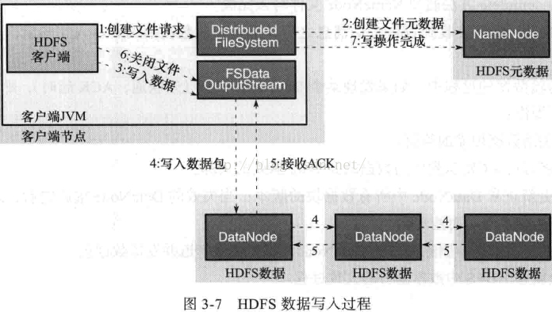

## 一 分布式文件系统介绍

在hadoop当中，分布式文件系统（HDFS），对文件系统有一个抽象，HDFS属于当中的一个实现类，也就是说分布式文件系统类似于一个接口，定义了标准，下面有很多的实现类，其中HDFS是一个子实现类而已，但是现在很多人都只知道一种就是HDFS的实现，并没有了解过其他的实现类，其实分布式文件系统的实现有很多种，具体详细参见hadoop权威指南第三版第59页。  

## 二 图解HDFS架构

#### 2.1 NameNode与DataNode

    


NameNode:单一节点的中心服务器，负责的事情有
- 管理文件系统的命名空间
- 客户端对文件的访问

NameNode和DataNode区别：  


NameNode只负责文件元数据的操作，文件相关的数据流不经过NamenODE，只循环跟哪个dataNode有联系（这样NameNode不会成为系统瓶颈），文件的具体读写请求交给datanode处理。  

副本存放在哪些Datanode上由NameNode来控制，根据全局情况作出块放置决定，读取文件时NameNode尽量让用户先读取最近的副本，降低读取网络开销和读取延时。  

NameNode全权管理数据库的复制，它周期性的从集群中的每个DataNode接收心跳信合和状态报告，接收到心跳信号意味着DataNode节点工作正常，块状态报告包含了一个该DataNode上所有的数据列表。  

#### 2.2 文件副本机制与块存储

所有的文件都是以block块的方式存放在HDFS文件系统当中。   

在hadoop1当中，文件的block块默认大小是64M，hadoop2当中，文件的block块大小默认是128M，block块的大小可以通过hdfs-site.xml当中的配置文件进行指定：
```
   <property>
        <name>dfs.block.size</name>
        <value>块大小以字节为单位</value>//只写数值就可以
    </property>
```

  

抽象成数据块的好处：  
- 一个文件有可能大于集群中任意一个磁盘 10T*3/128 = xxx块 2T，2T，2T 文件方式存—–>多个block块，这些block块属于一个文件
- 使用块抽象而不是文件可以简化存储子系统
- 块非常适合用于数据备份进而提供数据容错能力和可用性

块缓存：  

通常DataNode从磁盘中读取块，但对于访问频繁的文件，其对应的块可能被显示的缓存在DataNode的内存中，以堆外块缓存的形式存在。默认情况下，一个块仅缓存在一个DataNode的内存中，当然可以针对每个文件配置DataNode的数量。作业调度器通过在缓存块的DataNode上运行任务，可以利用块缓存的优势提高读操作的性能。  

例如：连接（join）操作中使用的一个小的查询表就是块缓存的一个很好的候选。用户或应用通过在缓存池中增加一个cache directive来告诉namenode需要缓存哪些文件及存多久。缓存池（cache pool）是一个拥有管理缓存权限和资源使用的管理性分组。  

例如：一个文件 130M，会被切分成2个block块，保存在两个block块里面，实际占用磁盘130M空间，而不是占用256M的磁盘空间。  

#### 2.3 hdfs的文件权限验证

hdfs的文件权限机制与linux系统的文件权限机制类似：
- r:read   
- w:write  
- x:execute  权限x对于文件表示忽略，对于文件夹表示是否有权限访问其内容

#### 2.4 元素据FSimage以及edits和secondaryNameNode

当NameNode就一个的时候，所有的元数据信息都保存在FsImage与Eidts文件当中，配置位于hdfs-site.xml当中：
- fsimage:存放了namenode中完整的元数据的镜像，一般称为检查点。
- edits：记录一段时间内的元数据信息变化，例如增删改了哪些文件，文件内容较。
- secondarynameNode：edits在操作时间过长后，也会无限变大，secondarynameNode用于合并fsimage和edits，清空edits。

客户端对hdfs进行写文件时会首先被记录在edits文件中，edits修改时元数据也会更新。每次hdfs更新时edits先更新后客户端才会看到最新信息。  

一般开始时对namenode的操作都放在edits中，为什么不放在fsimage中呢？  

因为fsimage是namenode的完整的镜像，内容很大，如果每次都加载到内存的话生成树状拓扑结构，这是非常耗内存和CPU。  

fsimage内容包含了namenode管理下的所有datanode中文件及文件block及block所在的datanode的元数据信息。随着edits内容增大，就需要在一定时间点和fsimage合并。  

使用命令 `hdfs  oiv ` 可以查看 FSimage文件当中的文件信息：
```
cd  /usr/local/hadoop-2.6.0-cdh5.14.0/hadoopDatas/namenodeDatas/current
hdfs oiv -i fsimage_0000000000000000864 -p XML -o hello.xml
```

使用命令 ` hdfs  oev ` 可以查看edits当中的文件信息：
```
cd  /usr/local/hadoop-2.6.0-cdh5.14.0/hadoopDatas/dfs/nn/edits
hdfs oev -i  edits_0000000000000000865-0000000000000000866 -o myedit.xml -p XML
```

secondarynameNode如何辅助管理FSImage与Edits文件:
- secnonaryNN通知NameNode切换editlog
- secondaryNN从NameNode中获得FSImage和editlog(通过http方式)
- secondaryNN将FSImage载入内存，然后开始合并editlog，合并之后成为新的fsimage
- secondaryNN将新的fsimage发回给NameNode
- NameNode用新的fsimage替换旧的fsimage

如图所示：  

  

  

完成合并的是secondarynamenode，会请求namenode停止使用edits,暂时将新写操作放入一个新的文件中（edits.new)。  

secondarynamenode从namenode中通过http get获得edits，因为要和fsimage合并，所以也是通过http get 的方式把fsimage加载到内存，然后逐一执行具体对文件系统的操作，与fsimage合并，生成新的fsimage，然后把fsimage发送给namenode，通过http post的方式。namenode从secondarynamenode获得了fsimage后会把原有的fsimage替换为新的fsimage,把edits.new变成edits。同时会更新fstime。  

hadoop进入安全模式时需要管理员使用dfsadmin的save namespace来创建新的检查点。  

secondarynamenode在合并edits和fsimage时需要消耗的内存和namenode差不多，所以一般把namenode和secondarynamenode放在不同的机器上。  

- fs.checkpoint.period: 默认是一个小时（3600s)
- fs.checkpoint.size:  edits达到一定大小时也会触发合并（默认64MB)


问题：edits什么时候跟fsimage合并？？？   

控制策略：时间长短  +  文件大小 比如说我们可以定义两个小时，或者edits文件大小达到1GB的时候合并一次