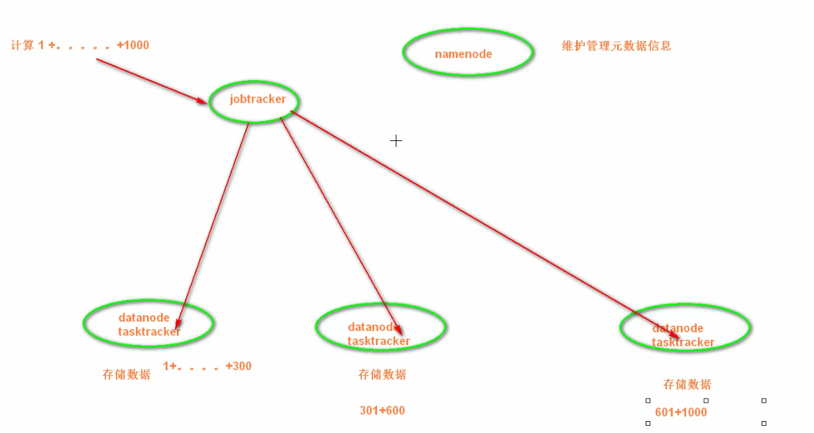
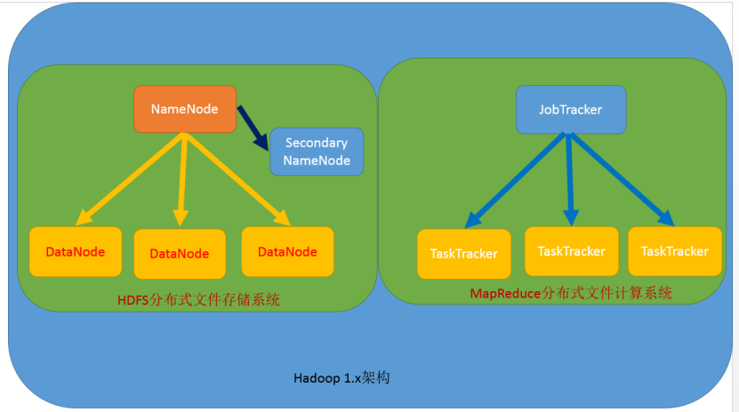

## 一 hadoop1.x架构模型  

  

1.x架构分为两大模块：
- 分布式文件存储系统HDFS：
  - NameNode：集群当中的主节点，主要用于管理集群当中的各种数据(元数据信息)
  - secondaryNameNode：作用就是用于合并元数据信息，辅助namenode管理元数据信息
  - DataNode：集群当中的从节点，主要用于存储集群当中的各种数据
- 分布式文件计算系统MapReduce：
  - JobTracker：主节点，主要功能有接收用户提交的计算任务，分配任务给从节点执行
  - TaskTracker：从节点，主要用于接收主节点分配的任务，并执行任务

元数据信息：文件名称，文件路径，文件的大小，文件的权限等文件的描述数据

## 二 hadoop2.x架构模型  

1.x当中，主节点  namenode  jobtracker都存在单节点故障问题，2.x解决了该问题。  

#### 2.1 NameNode与ResourceManager单节点架构模型

  

- 分布式文件存储系统HDFS：
  - NameNode：集群当中的主节点，主要用于管理集群当中的各种数据
  - secondaryNameNode：主要能用于hadoop当中元数据信息的辅助管理
  - DataNode：集群当中的从节点，主要用于存储集群当中的各种数据
- 资源调度系统Yarn：
  - ResourceManager：接收用户的计算请求任务，并负责集群的资源分配（1.x中Jobtracker还会分配任务），会为每个计算任务启动一个AppMaster，AppMaster主要负责资源的申请，任务的分配
  - NodeManager：负责执行主节点APPmaster分配的任务

#### 2.2 NameNode单节点与ResourceManager高可用架构模型

 

- 文件系统核心模块：
  - NameNode：集群当中的主节点，主要用于管理集群当中的各种数据
  - secondaryNameNode：主要能用于hadoop当中元数据信息的辅助管理
  - DataNode：集群当中的从节点，主要用于存储集群当中的各种数据
- 数据计算核心模块：
  - ResourceManager：接收用户的计算请求任务，并负责集群的资源分配，以及计算任务的划分，通过zookeeper实现ResourceManager的高可用
  - NodeManager：负责执行主节点ResourceManager分配的任务

#### 2.3 NameNode高可用与ResourceManager单节点架构模型

   

如果namenode高可用：就没有secondaryNamenode了，取而代之的是journalNode：主要用于同步元数据信息，保证两个namenode的元数据信息是一致的
并且journalNode需要奇数个，半数及以上的journalNode写入元数据成功，就代表写入成功

- 文件系统核心模块：
  - NameNode：集群当中的主节点，主要用于管理集群当中的各种数据，其中 nameNode可以有两个，形成高可用状态。 active状态：主要负责用户的写请求， standBy状态：主要负责瞄着active什么时候死了，赶紧上位，两个namenode组成主备的架构   
  - DataNode：集群当中的从节点，主要用于存储集群当中的各种数据
  - JournalNode：文件系统元数据信息管理
- 数据计算核心模块：
  - ResourceManager：接收用户的计算请求任务，并负责集群的资源分配，以及计算任务的划分
  - NodeManager：负责执行主节点ResourceManager分配的任务

#### 2.4 NameNode与ResourceManager高可用架构模型  

为了避免集群的脑裂，造成看到的数据不一致，一定要保证两个namenode当中的元数据信息一模一样，journalnode就是同步两个namenode当中的元数据信息，保证两个namenode当中的元数据信息一模一样  

namenode高可用的自动切换，主要是通过两个守护进程zkfc来实现的

 

- 文件系统核心模块：
  - NameNode：集群当中的主节点，主要用于管理集群当中的各种数据，一般都是使用两个，实现HA高可用
  - JournalNode：元数据信息管理进程，一般都是奇数个
  - DataNode：从节点，用于数据的存储
- 数据计算核心模块：
  - ResourceManager：Yarn平台的主节点，主要用于接收各种任务，通过两个，构建成高可用
  - NodeManager：Yarn平台的从节点，主要用于处理ResourceManager分配的任务