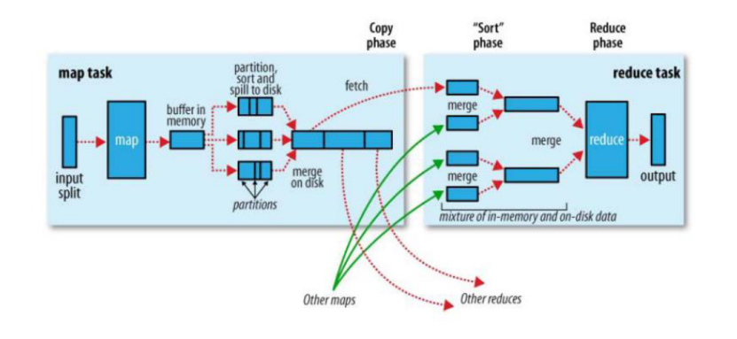

## 一 MapReduceshuffle过程

map阶段处理的数据如何传递给reduce阶段，是MapReduce框架中最关键的一个流程，这个流程就叫shuffle。  

shuffle: 洗牌、发牌——（核心机制：数据分区，排序，分组，规约，合并等过程）。  


  

shuffle是Mapreduce的核心，它分布在Mapreduce的map阶段和reduce阶段。一般把从Map产生输出开始到Reduce取得数据作为输入之前的过程称作shuffle。  

详细阶段：
- 1).Collect阶段：将MapTask的结果输出到默认大小为100M的环形缓冲区，保存的是key/value，Partition分区信息等。
- 2).Spill阶段：当内存中的数据量达到一定的阀值的时候，就会将数据写入本地磁盘，在将数据写入磁盘之前需要对数据进行一次排序的操作，如果配置了combiner，还会将有相同分区号和key的数据进行排序。
- 3).Merge阶段：把所有溢出的临时文件进行一次合并操作，以确保一个MapTask最终只产生一个中间数据文件。
- 4).Copy阶段：ReduceTask启动Fetcher线程到已经完成MapTask的节点上复制一份属于自己的数据，这些数据默认会保存在内存的缓冲区中，当内存的缓冲区达到一定的阀值的时候，就会将数据写到磁盘之上。
- 5).Merge阶段：在ReduceTask远程复制数据的同时，会在后台开启两个线程对内存到本地的数据文件进行合并操作。
- 6).Sort阶段：在对数据进行合并的同时，会进行排序操作，由于MapTask阶段

已经对数据进行了局部的排序，ReduceTask只需保证Copy的数据的最终整体有效性即可。  

Shuffle中的缓冲区大小会影响到mapreduce程序的执行效率，原则上说，缓冲区越大，磁盘io的次数越少，执行速度就越快
缓冲区的大小可以通过参数调整,  参数：mapreduce.task.io.sort.mb  默认100M

## 二 shuffle阶段数据的压缩机制

#### 2.0 压缩机制简介

在shuffle阶段，可以看到数据通过大量的拷贝，从map阶段输出的数据，都要通过网络拷贝，发送到reduce阶段，这一过程中，涉及到大量的网络IO，如果数据能够进行压缩，那么数据的发送量就会少得多，那么如何配置hadoop的文件压缩呢，以及hadoop当中的文件压缩支持哪些压缩算法呢？？  

为什么要配置压缩：
```
	MapReduce
		input
		mapper
		shuffle
			partitioner、sort、combiner、【compress】、group
		reducer
		output
```

#### 2.1 hadoop当中支持的压缩算法

文件压缩有两大好处，节约磁盘空间，加速数据在网络和磁盘上的传输，可以使用bin/hadoop checknative  来查看我们编译之后的hadoop支持的各种压缩，如果出现openssl为false，那么就在线安装一下依赖包
```
bin/hadoop checknative
yum install openssl-devel
```

hadoop支持的压缩算法：
```
压缩格式     工具	    算法	  文件扩展名	是否可切分
DEFLATE	    无	    DEFLATE	    .deflate	否
Gzip        gzip	DEFLATE	    .gz	        否
bzip2	    bzip2	bzip2	    bz2	        是
LZO	        lzop	LZO	        .lzo	    否
LZ4	        无	    LZ4	        .lz4	    否
Snappy	    无	    Snappy	    .snappy	    否
```

各种压缩算法对应使用的java类：
```
DEFLATE     org.apache.hadoop.io.compress.DeFaultCodec
gzip        org.apache.hadoop.io.compress.GZipCodec
bzip2       org.apache.hadoop.io.compress.BZip2Codec
LZO         com.hadoop.compression.lzo.LzopCodec
LZ4         org.apache.hadoop.io.compress.Lz4Codec
Snappy      org.apache.hadoop.io.compress.SnappyCodec
```

常见的压缩速率比较：
```
压缩算法	原始文件大小	压缩后的文件大小	压缩速度	    解压缩速度
gzip        8.3GB　　	    1.8GB	        17.5MB/s	    58MB/s
bzip2	    8.3GB	        1.1GB	        2.4MB/s	        9.5MB/s
LZO-bset	8.3GB	        2GB	            4MB/s	        60.6MB/s
LZO	        8.3GB	        2.9GB	        49.3MB/S	    74.6MB/s
```

#### 2.2 开启压缩方式

方式一：在代码中进行设置压缩  

```
# 设置map阶段的压缩
Configuration configuration = new Configuration();
configuration.set("mapreduce.map.output.compress","true");
configuration.set("mapreduce.map.output.compress.codec","org.apache.hadoop.io.compress.SnappyCodec");

# 设置reduce阶段的压缩
configuration.set("mapreduce.output.fileoutputformat.compress","true");
configuration.set("mapreduce.output.fileoutputformat.compress.type","RECORD");
configuration.set("mapreduce.output.fileoutputformat.compress.codec","org.apache.hadoop.io.compress.SnappyCodec");
```

方式二：配置全局的MapReduce压缩。修改mapred-site.xml配置文件，然后重启集群，以便对所有的mapreduce任务进行压缩
```xml
<!-- map输出数据进行压缩 -->
<property>
          <name>mapreduce.map.output.compress</name>
          <value>true</value>
</property>
<property>
         <name>mapreduce.map.output.compress.codec</name>
         <value>org.apache.hadoop.io.compress.SnappyCodec</value>
</property>

<!-- reduce输出数据进行压缩 -->

<property>       <name>mapreduce.output.fileoutputformat.compress</name>
       <value>true</value>
</property>
<property>         <name>mapreduce.output.fileoutputformat.compress.type</name>
        <value>RECORD</value>
</property>
 <property>        <name>mapreduce.output.fileoutputformat.compress.codec</name>
        <value>org.apache.hadoop.io.compress.SnappyCodec</value> </property>
```

贴士：所有节点都要修改mapred-site.xml，修改完成之后记得重启集群  

#### 2.3 使用hadoop的snappy压缩来对我们的数据进行压缩

第一步：代码中添加配置，通过修改代码的方式来实现数据的压缩

```
# map阶段输出压缩配置
Configuration configuration = new Configuration();
configuration.set("mapreduce.map.output.compress","true");
configuration.set("mapreduce.map.output.compress.codec","org.apache.hadoop.io.compress.SnappyCodec");

# reduce阶段输出压缩配置
configuration.set("mapreduce.output.fileoutputformat.compress","true");
configuration.set("mapreduce.output.fileoutputformat.compress.type","RECORD");
configuration.set("mapreduce.output.fileoutputformat.compress.codec","org.apache.hadoop.io.compress.SnappyCodec");
```

第二步：重新打包测试mr程序,会发现我们的MR运行之后的输出文件都变成了以.snappy的压缩文件
