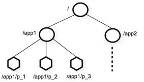

## 一 Zookeeper数据模型

#### 1.1 节点

ZooKeeper 的数据模型，在结构上和标准文件系统的非常相似，拥有一个层次的命名空间，都是采用树形层次结构。  

ZooKeeper树中的每个节点被称为—Znode，和文件系统的目录树一样，ZooKeeper 树中的每个节点可以拥有子节点。  

不同之处：
- 1.Znode 兼具文件和目录两种特点。既像文件一样维护着数据、元信息、ACL、 时间戳等数据结构，又像目录一样可以作为路径标识的一部分，并可以具有 子 Znode。用户对 Znode 具有增、删、改、查等操作（权限允许的情况下）。即节点可以是 /node1，其下可以继续创建 /node1/node2这是2个节点，且都可以存储数据，不过临时节点不能有子节点
- 2.Znode 具有原子性操作，读操作将获取与节点相关的所有数据，写操作也将 替换掉节点的所有数据。另外，每一个节点都拥有自己的 ACL(访问控制列表)，这个列表规定了用户的权限，即限定了特定用户对目标节点可以执行的操作。
- 3.Znode 存储数据大小有限制。ZooKeeper 虽然可以关联一些数据，但并没有 被设计为常规的数据库或者大数据存储，相反的是，它用来管理调度数据， 比如分布式应用中的配置文件信息、状态信息、汇集位置等等。这些数据的 共同特性就是它们都是很小的数据，通常以 KB 为大小单位。ZooKeeper 的服 务器和客户端都被设计为严格检查并限制每个 Znode 的数据大小至多 1M，常规使用中应该远小于此值。
- 4.Znode 通过路径引用，如同 Unix 中的文件路径。路径必须是绝对的，因此他 们必须由斜杠字符来开头。除此以外，他们必须是唯一的，也就是说每一个 路径只有一个表示，因此这些路径不能改变。在 ZooKeeper 中，路径由 Unicode 字符串组成，并且有一些限制。字符串"/zookeeper"用以保存管理 信息，比如关键配额信息。

#### 1.2 节点数据结构 



图中的每个节点称为一个 Znode。 每个 Znode 由 3 部分组成：
- stat：此为状态信息, 描述该 Znode 的版本, 权限等信息
- data：与该 Znode 关联的数据
- children：该 Znode 下的子节点

#### 1.3 节点类型  

Znode 有两种：
- 临时节点：该节点的生命周期依赖于创建它们的会话，一旦会话结束，临时 节点将被自动删除，当然可以也可以手动删除。临时节点不允许拥有子节点。
- 永久节点：该节点的生命周期不依赖于会话，并且只有在客户端显示执行删

注意：节点的类型在创建时即被确定，并且不能改变。

Znode 还有一个序列化的特性，如果创建的时候指定的话，该 Znode 的名字，后面会自动追加一个不断增加的序列号。序列号对于此节点的父节点来说是唯一
的，这样便会记录每个子节点创建的先后顺序。它的格式为“%10d”(10 位数字，没有数值的数位用 0 补充，例如“0000000001”)。

这样便会存在四种类型的 Znode 节点，分别对应：
- PERSISTENT：永久节点
- EPHEMERAL：临时节点
- PERSISTENT_SEQUENTIAL：永久节点、序列化
- EPHEMERAL_SEQUENTIAL：临时节点、序列化

#### 1.4 节点属性

每个 znode 都包含了一系列的属性，通过命令 get，可以获得节点的属性：
- dataVersion：数据版本号，每次对节点进行 set 操作，dataVersion 的值都会增加 1（即使设置的是相同的数据），可有效避免了数据更新时出现的先后顺序问题。
- cversion ：子节点的版本号。当 znode 的子节点有变化时，cversion 的值就会增加 1。
- aclVersion ：ACL 的版本号。
- cZxid ：Znode 创建的事务 id。
- mZxid	：Znode 被修改的事务 id，即每次对 znode 的修改都会更新 mZxid。对于 zk 来说，每次的变化都会产生一个唯一的事务 id，zxid（ZooKeeper Transaction Id）。通过 zxid，可以确定更新操作的先后顺序。例如，如果 zxid1 小于 zxid2，说明 zxid1 操作先于 zxid2 发生，zxid 对于整个 zk 都是唯一的，即使操作的是不同的 znode。
- ctime：节点创建时的时间戳.
- mtime：节点最新一次更新发生时的时间戳.
- ephemeralOwner:如果该节点为临时节点, ephemeralOwner 值表示与该节点绑定的 session id. 如果不是, ephemeralOwner 值为 0.在 client 和 server 通信之前,首先需要建立连接,该连接称为 session。连接建立后,如果发生连接超时、授权失败,或者显式关闭连接,连接便处于 CLOSED状态, 此时 session 结束。

## 二 Zookeeper的watch机制

#### 2.1 watch机制特点

ZooKeeper 提供了分布式数据发布/订阅功能，统一定义了一对多的订阅关系，能让多个订阅者同时监听某一个主题对象，当这个主题对象自身状态变化时，会通知所有订阅者，使他们能够做出相应的处理。  

ZooKeeper 中，引入了 Watcher 机制来实现这种分布式的通知功能 。ZooKeeper 允许客户端向服务端注册一个 Watcher 监听，当服务端的一些事件触发了这个 Watcher，那么就会向指定客户端发送一个事件通知来实现分布式的通知功能。  

触发事件种类很多，如：节点创建，节点删除，节点改变，子节点改变等。

总的来说可以概括 Watcher 为以下三个过程：
- 1.客户端向服务端注册 Watcher
- 2.服务端事件发生触发 Watcher
- 3.客户端回调 Watcher 得到触发事件情况

watch机制特点：
- 先注册再触发：Zookeeper 中的 watch 机制，必须客户端先去服务端注册监听，这样事件发送才会触发监听，通知给客户端。
- 一次性触发：事件发生触发监听，一个 watcher event 就会被发送到设置监听的客户端，这种效果是一次性的，后续再次发生同样的事件，不会再次触发。
- 事件封装：ZooKeeper 使用 WatchedEvent 对象来封装服务端事件并传递。WatchedEvent 包含了每一个事件的三个基本属性：通知状态（keeperState），事件类型（EventType）和节点路径（path）
- event 异步发送：watcher 的通知事件从服务端发送到客户端是异步的。

#### 2.2 通知状态和事件类型  
```
KeeperState         EventType           触发条件与说明

	                None -1             客户端与服务端连接成功

                    NodeCreateed 1      watcher监听的对应节点被创建           
SyncConnected 0     NodeDelete 2        Watcher 监听的对应数据节点被删除，此时客户端和服务器处于连接状态      
                    NodeDataChanged 3   Watcher 监听的对应数据节点的数据内容 发生变更	
                    NodeChildChanged 4  Wather 监听的对应节点的子节点数据列表发生变更

Disconnected 0      None -1             客户端与zookeeper服务器断开连接	此时客户端和服务器处于断开连接状态	
		
Expired -112	    None -1             会话超时，此时客户端会话失效，通常同时也会收到SessionExpiredException 异常     
	
AuthFailed 4        None -1             使用错误的schema进行权限检查或者SASL权限检查失败，通常同时也会收到AuthFailedException异常
``` 

其中连接状态事件(type=None, path=null)不需要客户端注册，客户端只要有需要直接处理就行了。  

#### 2.3 shell客户端设置watch机制

```
# 设置节点数据变动监听
get /abc watch
# 通过另一个客户端更改节点数据，更改后设置监听的节点会收到通知
set /abc 666
```

通过上述可以配置监听 服务器集群种各个服务器的在线情况，不过要先注册监听器，再创建监听器。